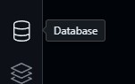
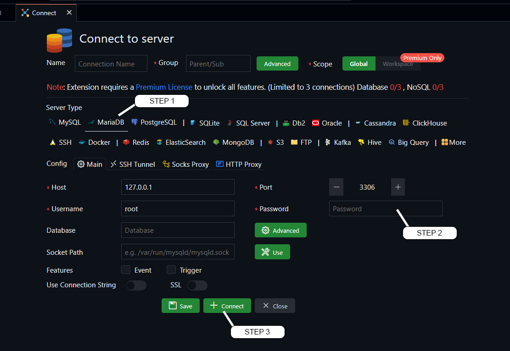

# Getting Started

When you start off your web based Codespace environment, the system will prepare your development environment for you complete with, VS Code, an MySQL Server with tools to connect to it and start coding. 
The setup of a new environment will take about a minute the first time, but once it’s set up, you should see the option.

Selecting the database extension will present us with the configuration screen for setting up a connection to our running SQL Database. 

### Setup your connection
Setting up the connection is very simple. After you click the Database option, simply select New Connection option.

Step 1 – Select MariaDB as the database type
Step 2 – Enter the password for the connection,, the password is: mariadb
Step 3 – Hit Save to make a connection to the database server. 

### Next Steps
1:  Setup database connection  
2:  Run create script  
3:  Run Seed script 
